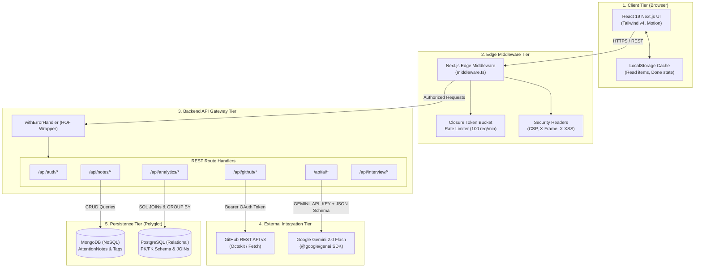
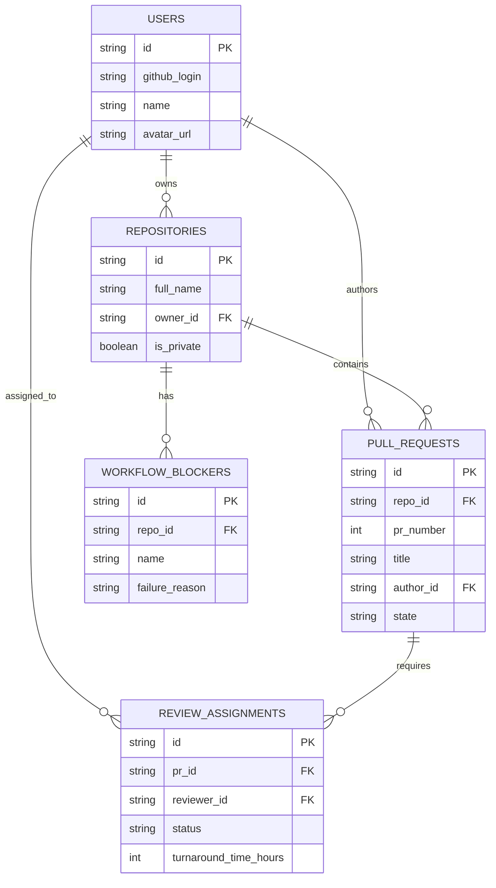
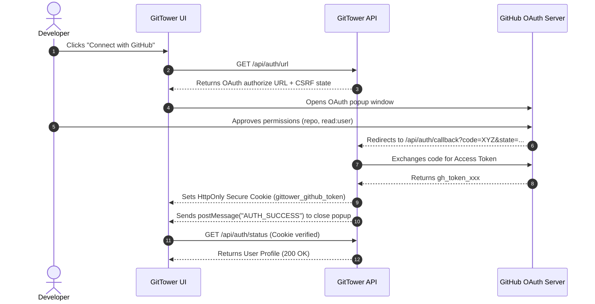

# 🏛️ High-Level Design (HLD) — GitTower

| Property | Details |
| :--- | :--- |
| **System Name** | **GitTower Architecture** |
| **Architecture Pattern** | Layered Multi-Tier with Edge Gateway & Polyglot Persistence |
| **Document Version** | 1.0.0 |
| **Status** | Approved / Production-Ready |
| **Hosting Platform** | Next.js App Router (Node.js runtime + Edge Middleware) |

---

## 1. Architectural Overview & Design Goals

GitTower is built as a **high-throughput, low-latency developer command center**. It aggregates external GitHub state, enriches it with generative AI analysis, and persists developer attention notes and analytics using a dual NoSQL/Relational data store.

### Key Architectural Tenets:
1. **Zero Cold-Start Latency**: Edge middleware validates tokens and enforces rate limits before hitting compute.
2. **Deterministic AI**: Enforce strict JSON Schema validation on LLM responses with offline heuristic failover.
3. **Polyglot Persistence**: 
   * **MongoDB (NoSQL)** for semi-structured attention documents and flexible triage tagging.
   * **PostgreSQL (Relational SQL)** for normalized review assignments, PR dependencies, and complex aggregate JOINs.
4. **Resilience & Graceful Degradation**: Built-in in-memory fallback engines for MongoDB, PostgreSQL, and Gemini LLM ensuring zero-downtime operation during network partitions or missing credentials.

---

## 2. Multi-Tier System Topology

---

## 3. Subsystem Breakdown

### 3.1 Tier 1: Client Application
* **Framework**: Next.js 15 App Router (`'use client'` single-page dynamic routing with query parameter synchronization).
* **State Management**:
  * React `useState` for local component UI state.
  * React `useEffect` for side-effects (URL `popstate` listeners, periodic CI/CD check polling, click-outside closures).
  * Optimistic UI updates for comment submission and issue status toggling.
* **Component Composition**: Decoupled slotted components ([`AIInsightCard.tsx`](file:///c:/Users/parveen/OneDrive/Desktop/GitTower/components/AIInsightCard.tsx), [`InterviewShowcaseModal.tsx`](file:///c:/Users/parveen/OneDrive/Desktop/GitTower/components/InterviewShowcaseModal.tsx), [`WorkTree.tsx`](file:///c:/Users/parveen/OneDrive/Desktop/GitTower/components/WorkTree.tsx), [`RightSidebar.tsx`](file:///c:/Users/parveen/OneDrive/Desktop/GitTower/components/RightSidebar.tsx)).

### 3.2 Tier 2: Edge Middleware Layer
* **Location**: [`middleware.ts`](file:///c:/Users/parveen/OneDrive/Desktop/GitTower/middleware.ts) running on the V8 Edge Runtime.
* **Token Bucket Rate Limiter**:
  * Implemented using JavaScript **closures** to encapsulate an in-memory token map.
  * Allows a maximum burst of 100 requests per IP with a refill rate of 1 token every 600ms.
* **Route Protection**:
  * Intercepts `/api/github/*` and `/api/notes/*` to verify session cookies (`gittower_github_token`).
* **Security & Observability Headers**:
  * Injects `X-Response-Time`, `X-Content-Type-Options: nosniff`, `X-Frame-Options: DENY`, `Referrer-Policy: strict-origin-when-cross-origin`.

### 3.3 Tier 3: API Gateway & Error Handling
* **Higher-Order Function**: [`withErrorHandler`](file:///c:/Users/parveen/OneDrive/Desktop/GitTower/lib/errors/withErrorHandler.ts) wraps all route handlers with:
  1. Standardized JSON response envelope: `{ success, data, error: { code, message, statusCode, details }, meta: { timestamp, path } }`.
  2. Typed error catching matching subclasses of [`AppError`](file:///c:/Users/parveen/OneDrive/Desktop/GitTower/lib/errors/AppError.ts) (`BadRequestError` [400], `UnauthorizedError` [401], `ForbiddenError` [403], `NotFoundError` [404], `ValidationError` [422], `TooManyRequestsError` [429], `InternalServerError` [500]).
  3. Latency instrumentation header (`X-Response-Time`).

### 3.4 Tier 4: External Integrations
* **Google Gemini API**:
  * Connected via `@google/genai` SDK in [`lib/ai/gemini.ts`](file:///c:/Users/parveen/OneDrive/Desktop/GitTower/lib/ai/gemini.ts).
  * System prompts with Chain-of-Thought guidelines in [`lib/ai/prompts.ts`](file:///c:/Users/parveen/OneDrive/Desktop/GitTower/lib/ai/prompts.ts).
  * Strict schema enforcement via `responseSchema` in [`lib/ai/schemas.ts`](file:///c:/Users/parveen/OneDrive/Desktop/GitTower/lib/ai/schemas.ts).
* **GitHub REST API**:
  * Uses concurrent async fetching (`Promise.all`) across 7 attention endpoints: notifications, review requests, user mentions, authored PRs, authored issues, involved threads, and assigned items.

### 3.5 Tier 5: Polyglot Persistence Layer

* **MongoDB (NoSQL Document Store)**:
  * Model: `AttentionNote` (`_id`, `repoFullName`, `itemNumber`, `itemType`, `authorLogin`, `title`, `notes`, `tags`, `priority`, `aiTriageSummary`, `isResolved`).
  * Indexing: Compound index on `{ repoFullName: 1, itemNumber: 1 }` for $O(1)$ lookups.
* **PostgreSQL (Relational Store)**:
  * Normalized tables with Primary Key (PK) and Foreign Key (FK) constraints.
  * SQL JOIN queries (`INNER JOIN`, `LEFT JOIN`, `AGGREGATE JOIN`) for team bottleneck computation.

---

## 4. Security Architecture

---

## 5. Resilience & Fault Tolerance Strategy

| Failure Scenario | Mitigation Mechanism | User Experience |
| :--- | :--- | :--- |
| **Gemini API Down / No Key** | Offline Heuristic Engine in [`lib/ai/gemini.ts`](file:///c:/Users/parveen/OneDrive/Desktop/GitTower/lib/ai/gemini.ts) calculates urgency based on keywords, label weights, and activity. | Seamless instant triage card generated without user-facing error. |
| **MongoDB Disconnected** | In-memory document store fallback in [`lib/db/mongodb.ts`](file:///c:/Users/parveen/OneDrive/Desktop/GitTower/lib/db/mongodb.ts) pre-seeded with sample notes. | Full CRUD remains interactive for demo/testing without crash. |
| **PostgreSQL Disconnected** | In-memory relational engine in [`lib/db/postgres.ts`](file:///c:/Users/parveen/OneDrive/Desktop/GitTower/lib/db/postgres.ts) with full join/aggregation logic. | Analytics queries (`INNER JOIN`, `LEFT JOIN`) execute reliably. |
| **GitHub Rate Limit (429)** | Edge middleware & route handler return standard `429 Too Many Requests` with `Retry-After` header. | UI shows clear cooldown timer. |
| **Network Flakiness** | Global `withErrorHandler` catches unhandled exceptions and returns standardized `500` JSON envelopes. | Error boundary prevents white-screen crash. |
