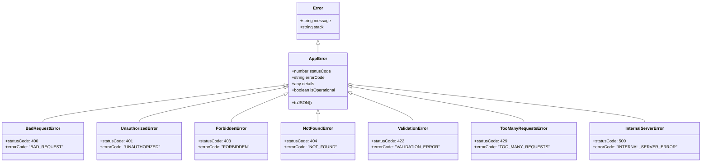
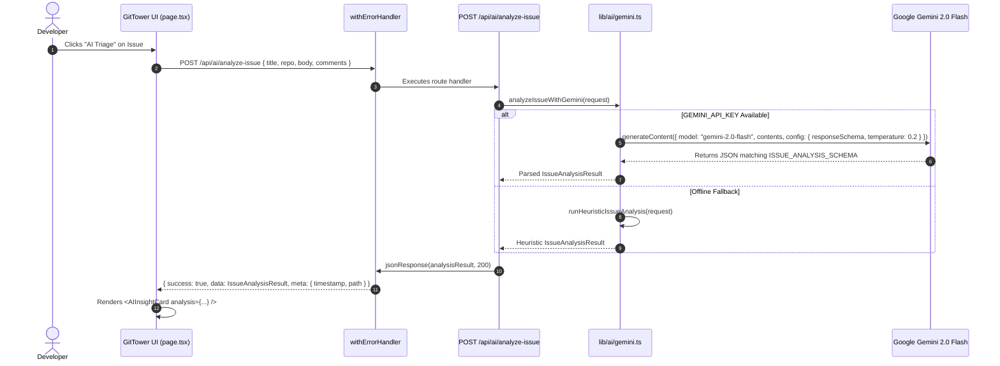
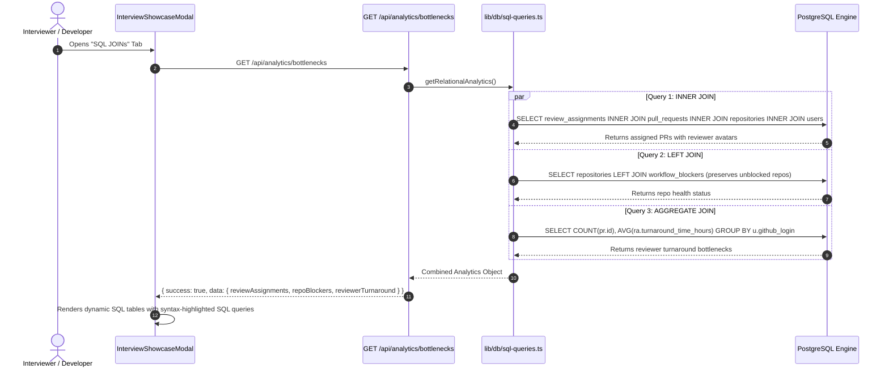

# 📐 Low-Level Design (LLD) — GitTower

| Property | Details |
| :--- | :--- |
| **System Name** | **GitTower Low-Level Architecture & Implementation Specs** |
| **Document Version** | 1.0.0 |
| **Status** | Approved / Production-Ready |
| **Primary Programming Language** | TypeScript / JavaScript (ES2024, Node.js, V8 Engine) |

---

## 1. Directory & Module Architecture

```
GitTower/
├── app/
│   ├── layout.tsx                    # Root HTML layout with Geist font & metadata
│   ├── page.tsx                      # Main single-page application & state coordinator
│   └── api/                          # Next.js App Router REST API Handlers
│       ├── auth/
│       │   ├── url/route.ts          # GET: Generates GitHub OAuth authorization URL
│       │   ├── callback/route.ts     # GET: Exchanges code for token & sets HttpOnly cookie
│       │   ├── status/route.ts       # GET: Returns current user authentication profile
│       │   └── logout/route.ts       # POST: Clears session cookie
│       ├── github/
│       │   ├── dashboard/route.ts    # GET: Concurrently fetches 7 attention queues
│       │   ├── timeline/route.ts     # GET: Fetches issue/PR events timeline
│       │   ├── checks/route.ts       # GET: Fetches CI/CD workflow runs & check suites
│       │   ├── action/route.ts       # POST: Executes COMMENT, CLOSE, REOPEN, MERGE actions
│       │   └── contributors/route.ts # GET: Fetches repo contributors for @ mention autocomplete
│       ├── ai/
│       │   ├── analyze-issue/route.ts # POST: LLM Issue Triage with JSON Schema output
│       │   └── pr-review/route.ts     # POST: LLM Automated PR Review & Checklist
│       ├── notes/
│       │   ├── route.ts              # GET (List), POST (Create - HTTP 201)
│       │   └── [id]/route.ts         # PATCH (Update), DELETE (Remove)
│       ├── analytics/
│       │   └── bottlenecks/route.ts  # GET: Relational SQL JOINs Analytics
│       └── interview/
│           └── js-benchmark/route.ts # GET: V8 Event Loop & Closures Runtime Benchmark
├── components/
│   ├── AIInsightCard.tsx             # Composable slotted AI insight presentation component
│   ├── InterviewShowcaseModal.tsx    # Tabbed modal presenting all 25 rubric items
│   ├── RightSidebar.tsx              # Live Activity Center (Active Work, Blockers, Timeline)
│   ├── WorkTree.tsx                  # Hierarchical repository and PR tree visualizer
│   └── LandingPage.tsx               # Product introduction and OAuth connect screen
├── lib/
│   ├── ai/
│   │   ├── gemini.ts                 # Google GenAI SDK client & heuristic fallback engine
│   │   ├── prompts.ts                # Prompt engineering (Role, Few-shot, Chain-of-Thought)
│   │   └── schemas.ts                # Type definitions and Gemini responseSchema specifications
│   ├── config/
│   │   └── env.ts                    # Strict environment variable schema & validation
│   ├── db/
│   │   ├── mongodb.ts                # MongoDB singleton client & in-memory document store
│   │   ├── models/AttentionNote.ts   # Document model, TypeScript interface & CRUD handlers
│   │   ├── postgres.ts               # PostgreSQL connection pool & in-memory relational engine
│   │   └── sql-queries.ts            # Typed SQL queries (INNER JOIN, LEFT JOIN, Aggregates)
│   ├── errors/
│   │   ├── AppError.ts               # Typed custom error class hierarchy (400-500)
│   │   └── withErrorHandler.ts       # Higher-Order Function wrapping route handlers
│   └── js-concepts/
│       └── index.ts                  # Core JS engine demonstrations (Closures, Event Loop, etc.)
└── middleware.ts                     # Edge middleware for Auth, Rate Limiting, & Security
```

---

## 2. Type Hierarchy & Data Models

### 2.1 Error Handling Class Hierarchy



### 2.2 Standard API Response Envelope (`ApiResponse<T>`)

```typescript
export interface ApiResponse<T = any> {
  success: boolean;
  data?: T;
  error?: {
    code: string;
    message: string;
    statusCode: number;
    details?: any;
  };
  meta?: {
    timestamp: string;
    path?: string;
  };
}
```

---

### 2.3 AI Structured Output Models (`lib/ai/schemas.ts`)

```typescript
export interface IssueAnalysisResult {
  summary: string;
  urgencyScore: number; // Integer 1-10
  urgencyReason: string;
  sentiment: 'URGENT' | 'FRUSTRATED' | 'NEUTRAL' | 'POSITIVE';
  riskLevel: 'LOW' | 'MEDIUM' | 'HIGH' | 'CRITICAL';
  actionRecommendations: string[];
  suggestedLabels: string[];
  blockerIdentified: boolean;
  blockerDetails?: string;
}

export interface PRReviewResult {
  summary: string;
  riskScore: number; // Integer 1-10
  riskLevel: 'LOW' | 'MEDIUM' | 'HIGH' | 'CRITICAL';
  breakingChangesDetected: boolean;
  breakingChangeDetails?: string;
  checklist: Array<{ item: string; passed: boolean; note?: string }>;
  suggestedReviewComment: string;
  recommendedAction: 'APPROVE' | 'REQUEST_CHANGES' | 'COMMENT';
}
```

---

### 2.4 NoSQL Document Model (`lib/db/models/AttentionNote.ts`)

```typescript
export type NotePriority = 'P0' | 'P1' | 'P2' | 'P3';

export interface AttentionNoteDocument {
  _id?: string;
  id: string;
  repoFullName: string;
  itemNumber: number;
  itemType: 'issue' | 'pull_request';
  authorLogin: string;
  title: string;
  notes: string;
  tags: string[];
  priority: NotePriority;
  aiTriageSummary?: string;
  isResolved: boolean;
  createdAt: string;
  updatedAt: string;
}
```

---

### 2.5 Relational SQL Schema DDL (`lib/db/postgres.ts`)

```sql
-- Users Table
CREATE TABLE IF NOT EXISTS users (
  id VARCHAR(64) PRIMARY KEY,
  github_login VARCHAR(255) UNIQUE NOT NULL,
  name VARCHAR(255) NOT NULL,
  avatar_url TEXT NOT NULL,
  created_at TIMESTAMP WITH TIME ZONE DEFAULT CURRENT_TIMESTAMP
);

-- Repositories Table
CREATE TABLE IF NOT EXISTS repositories (
  id VARCHAR(64) PRIMARY KEY,
  full_name VARCHAR(255) UNIQUE NOT NULL,
  owner_id VARCHAR(64) REFERENCES users(id) ON DELETE CASCADE,
  is_private BOOLEAN DEFAULT false,
  created_at TIMESTAMP WITH TIME ZONE DEFAULT CURRENT_TIMESTAMP
);

-- Pull Requests Table
CREATE TABLE IF NOT EXISTS pull_requests (
  id VARCHAR(64) PRIMARY KEY,
  repo_id VARCHAR(64) REFERENCES repositories(id) ON DELETE CASCADE,
  pr_number INTEGER NOT NULL,
  title VARCHAR(500) NOT NULL,
  author_id VARCHAR(64) REFERENCES users(id),
  state VARCHAR(32) NOT NULL,
  created_at TIMESTAMP WITH TIME ZONE DEFAULT CURRENT_TIMESTAMP,
  UNIQUE(repo_id, pr_number)
);

-- Review Assignments Table (Many-to-Many Bridge with Metrics)
CREATE TABLE IF NOT EXISTS review_assignments (
  id VARCHAR(64) PRIMARY KEY,
  pr_id VARCHAR(64) REFERENCES pull_requests(id) ON DELETE CASCADE,
  reviewer_id VARCHAR(64) REFERENCES users(id),
  status VARCHAR(32) NOT NULL, -- 'PENDING', 'APPROVED', 'CHANGES_REQUESTED'
  assigned_at TIMESTAMP WITH TIME ZONE DEFAULT CURRENT_TIMESTAMP,
  turnaround_time_hours INTEGER DEFAULT 0
);

-- Workflow Blockers Table
CREATE TABLE IF NOT EXISTS workflow_blockers (
  id VARCHAR(64) PRIMARY KEY,
  repo_id VARCHAR(64) REFERENCES repositories(id) ON DELETE CASCADE,
  name VARCHAR(255) NOT NULL,
  failure_reason TEXT NOT NULL,
  detected_at TIMESTAMP WITH TIME ZONE DEFAULT CURRENT_TIMESTAMP
);
```

---

## 3. REST API Endpoint Specifications

| HTTP Method | Route | Description | Status Codes | Auth Required |
| :--- | :--- | :--- | :--- | :--- |
| `GET` | `/api/auth/url` | Generates OAuth redirect URL | `200` | No |
| `GET` | `/api/auth/callback` | Exchanges code for session cookie | `200`, `400` | No |
| `GET` | `/api/auth/status` | Returns authenticated user profile | `200`, `401` | Yes (Cookie) |
| `POST` | `/api/auth/logout` | Clears authentication cookie | `200` | No |
| `GET` | `/api/github/dashboard` | Aggregates 7 attention queues | `200`, `401`, `500` | Yes |
| `GET` | `/api/github/timeline` | Fetches issue/PR events timeline | `200`, `400`, `401` | Yes |
| `GET` | `/api/github/checks` | Fetches CI/CD check suites | `200`, `400`, `401` | Yes |
| `POST` | `/api/github/action` | Executes COMMENT, CLOSE, REOPEN, MERGE | `200`, `400`, `401` | Yes |
| `POST` | `/api/ai/analyze-issue` | Gemini Issue Triage & Urgency Scoring | `200`, `400`, `422` | No (Public or Demo) |
| `POST` | `/api/ai/pr-review` | Gemini PR Automated Review Checklist | `200`, `400`, `422` | No (Public or Demo) |
| `GET` | `/api/notes` | Lists all developer attention notes | `200`, `401` | No / Optional |
| `POST` | `/api/notes` | Creates new attention note document | `201`, `400`, `422` | No / Optional |
| `PATCH` | `/api/notes/[id]` | Partially updates note by ID | `200`, `400`, `404` | No / Optional |
| `DELETE` | `/api/notes/[id]` | Deletes note document by ID | `200`, `400`, `404` | No / Optional |
| `GET` | `/api/analytics/bottlenecks` | Executes SQL JOINs & aggregate query | `200`, `500` | No / Optional |
| `GET` | `/api/interview/js-benchmark` | Runs V8 Event Loop & Closures test | `200` | No |

---

## 4. Key Sequence Flows

### 4.1 AI Issue Triage Execution Sequence



---

### 4.2 Relational SQL JOINs Analytics Flow



---

## 5. JavaScript Core Concepts Engine (`lib/js-concepts/index.ts`)

### 5.1 V8 Event Loop Trace Algorithm
Demonstrates the exact ordering of execution across the JavaScript runtime:
1. **Synchronous Call Stack**: Immediate execution (`log.push("1. [Call Stack] Synchronous Start")`).
2. **Macrotask Scheduling**: `setTimeout(() => log.push("4. [Macrotask] setTimeout"), 0)` queued to Timer Macrotask Queue.
3. **Microtask Scheduling**: `queueMicrotask(...)` and `Promise.resolve().then(...)` queued to Microtask Queue.
4. **Execution Order Output**:
   $$\text{Call Stack (Sync)} \longrightarrow \text{Microtasks (Promise/queueMicrotask)} \longrightarrow \text{Macrotasks (setTimeout)}$$

### 5.2 Closure State Encapsulation (`createMemoizer`)
```typescript
export function createMemoizer<TInput, TOutput>(fn: (arg: TInput) => TOutput) {
  const cache = new Map<string, { value: TOutput; timestamp: number }>();
  let hits = 0;
  let misses = 0;

  return {
    execute: (arg: TInput): { result: TOutput; isCached: boolean; stats: any } => {
      const key = JSON.stringify(arg);
      if (cache.has(key)) {
        hits++;
        return { result: cache.get(key)!.value, isCached: true, stats: { hits, misses, cacheSize: cache.size } };
      }
      misses++;
      const result = fn(arg);
      cache.set(key, { value: result, timestamp: Date.now() });
      return { result, isCached: false, stats: { hits, misses, cacheSize: cache.size } };
    },
    clearCache: () => cache.clear(),
  };
}
```

### 5.3 Parallel vs Sequential Async Benchmark
* **Sequential Loop**: $\sum_{i=1}^n \text{delay}_i \approx 30\text{ ms} + 30\text{ ms} + 30\text{ ms} = 90\text{ ms}$.
* **Parallel Execution (`Promise.all`)**: $\max(\text{delay}_1, \dots, \text{delay}_n) \approx 30\text{ ms}$ ($3\times$ speedup).
