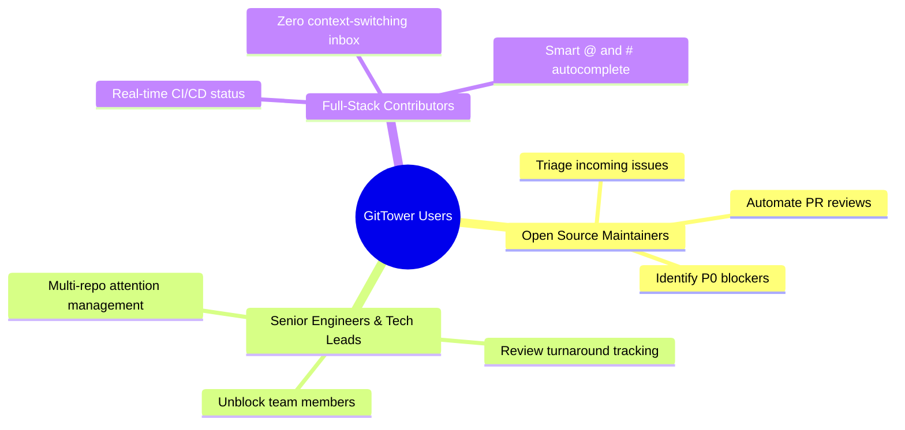
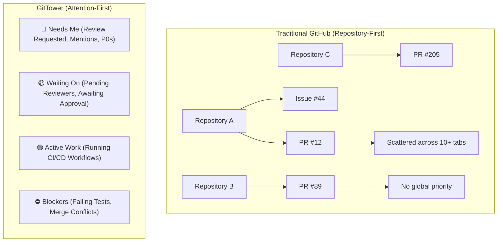
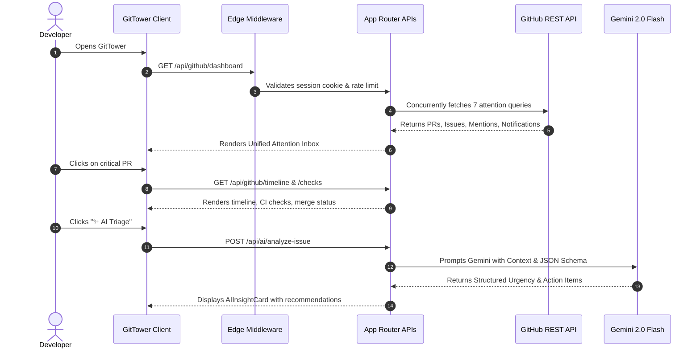

# 📄 Product Requirements Document (PRD) — GitTower

| Property | Details |
| :--- | :--- |
| **Product Name** | **GitTower** |
| **Tagline** | The Attention-First GitHub Command Center for High-Velocity Developers |
| **Document Version** | 1.0.0 |
| **Status** | Approved / Production-Ready |
| **Target Audience** | Open-Source Maintainers, Senior Engineers, Multi-Repo Contributors, Engineering Leads |
| **Tech Stack** | Next.js 15, React 19, TypeScript, Google Gemini 2.0/2.5 LLM, MongoDB, PostgreSQL, Tailwind v4 |

---

## 1. Executive Summary & Vision

Developers lose hours every day context-switching across dozens of GitHub repository tabs, chasing review requests, monitoring CI/CD builds, and deciphering notification noise.

> **Core Philosophy:**  
> * **GitHub organizes code. GitTower organizes work.**
> * **GitHub stores information. GitTower prioritizes attention.**
> * GitHub answers: *"What happened?"* $\rightarrow$ GitTower answers: *"What should I do next?"*

GitTower is a decision-first GitHub workspace that eliminates tab overload by aggregating pull requests, issues, mentions, CI/CD checks, and discussions into prioritized attention queues augmented with **Gemini AI Intelligence**.

---

## 2. Problem Statement & User Pain Points

### 2.1 The "20-Open-Tabs" Problem
* Developers working across multiple repositories have to constantly switch contexts between GitHub notifications, open PR tabs, CI workflow runs, and review requests.
* **Notification Fatigue**: GitHub notifications treat routine bot updates, automated releases, and critical review requests identically.
* **Missing Blockers**: Developers often don't realize their PR is blocked by a flaky check, merge conflict, or missing review until hours later.
* **Cognitive Load**: Assessing a PR or discussion requires reading through hundreds of comment lines to understand the core blocker.

---

## 3. Target Personas

1. **Persona A: Senior Staff Engineer / Tech Lead (Alex)**
   * *Pain*: Oversees 15+ microservice repositories. Needs to know which PRs are waiting on their review vs. which are blocked.
   * *Goal*: Open GitTower in the morning, see an organized "Needs Me" queue, and take action within minutes.
2. **Persona B: Open Source Maintainer (Sarah)**
   * *Pain*: Inundated with 100+ notifications daily. Difficult to triage urgent bugs from feature questions.
   * *Goal*: Use AI Triage to instantly score issue urgency (1-10) and extract actionable recommendations.

---

## 4. Mental Model: Repository-First vs Attention-First

---

## 5. Functional Requirements (FR)

### FR-1: GitHub OAuth & Secure Session Management
* **FR-1.1**: One-click GitHub OAuth login via popup window with `postMessage` synchronization.
* **FR-1.2**: Scopes requested: `repo`, `read:user`, `user:email`.
* **FR-1.3**: Access tokens stored in secure, `httpOnly`, `SameSite=Lax` cookies with 7-day expiration.

### FR-2: Unified Attention Buckets (The Smart Inbox)
* Concurrently fetches and categorizes GitHub items into 7 actionable views:
  1. **Unread Notifications**: Direct inbox items with subject URL resolution.
  2. **Review Requests**: Pull requests where user review is explicitly requested.
  3. **Mentions**: Conversations mentioning `@username`.
  4. **My Pull Requests**: Open pull requests authored by the user.
  5. **My Issues**: Open issues authored by the user.
  6. **Involved**: Active discussions where the user has participated.
  7. **Assigned to Me**: Work explicitly assigned to the user.
* **Mark as Done**: Client-side persistent local storage (`gittower_done_items`) with timestamp comparison to archive items without modifying GitHub remote state.

### FR-3: Hierarchical Work Tree & CI/CD Health
* Provider (`GitHub`) $\rightarrow$ Repositories $\rightarrow$ PRs / Issues tree.
* Real-time CI/CD status badges (`success`, `failure`, `pending`, `loading`) fetched dynamically for every active PR.
* Client-side search filter by title, issue number, or repository.

### FR-4: Gemini AI Attention Intelligence Engine
* **FR-4.1 (Issue Triage)**: Extracts executive summary, computes urgency score (1-10), classifies sentiment (`URGENT`, `FRUSTRATED`, `NEUTRAL`, `POSITIVE`), determines risk level, and generates 2-4 actionable next steps.
* **FR-4.2 (PR Review Assistant)**: Scans PR descriptions, check runs, and diffs to generate automated review checklists, breaking change warnings, and suggested review comments.
* **FR-4.3 (Structured Outputs)**: Guaranteed JSON Schema validation via Gemini `responseSchema`.

### FR-5: Detail & Conversational Timeline Pane
* Full event timeline (comments, assign/unassign events, label changes, cross-references with closing keyword detection, closures, merges).
* Rich markdown rendering with GitHub alerts (`[!NOTE]`, `[!WARNING]`, `[!IMPORTANT]`, `[!TIP]`, `[!CAUTION]`).
* Camo proxy URL rewriting for images.
* Live `@` mention autocomplete (fetching repo contributors) and `#` issue autocomplete.
* In-app context actions: Comment, Close/Reopen Issue, Merge Pull Request, Open in `github.dev` or Codespaces.

### FR-6: Custom Developer Attention Notes (NoSQL MongoDB CRUD)
* Allows developers to attach private triage notes, tags, and priority overrides (`P0-P3`) to any PR or issue.
* Full RESTful CRUD operations: `GET /api/notes`, `POST /api/notes` (201 Created), `PATCH /api/notes/[id]`, `DELETE /api/notes/[id]`.

### FR-7: Relational Bottleneck Analytics (PostgreSQL SQL JOINs)
* Calculates team turnaround time, review bottlenecks, and unblocked repository health using `INNER JOIN`, `LEFT JOIN`, and `AGGREGATE JOIN` (`GROUP BY`, `AVG`, `COUNT`).

---

## 6. Non-Functional Requirements (NFR)

| Category | Requirement | Target Metric |
| :--- | :--- | :--- |
| **Performance** | API Response Time (P95) | $< 250\text{ ms}$ (cached), $< 1.5\text{ s}$ (LLM triage) |
| **Throughput** | Edge Middleware Overhead | $< 5\text{ ms}$ latency injection |
| **Security** | Rate Limiting | 100 requests / minute per client IP (Token Bucket) |
| **Security** | Headers | Strict CSP, `X-Frame-Options: DENY`, `X-Content-Type-Options: nosniff` |
| **Reliability** | Availability & Offline Fallback | 99.9% uptime with deterministic heuristic fallback if LLM API is unavailable |
| **Usability** | Theme & Responsiveness | Dark mode theme, responsive desktop/mobile drawer, keyboard shortcuts (`Ctrl+B`, `Ctrl+I`) |

---

## 7. Key User Flow: Attention Processing

---

## 8. Success Metrics & KPIs

1. **Context Switching Reduction**: $> 70\%$ decrease in browser tabs open for GitHub.
2. **Review Turnaround Time (TAT)**: $40\%$ reduction in hours PRs spend waiting for review.
3. **Time to Triage**: Average time to identify critical blocking issues reduced from 45 minutes to $< 2$ minutes.
4. **Inbox Zero Rate**: Increased developer daily resolution rate by $3\times$.
